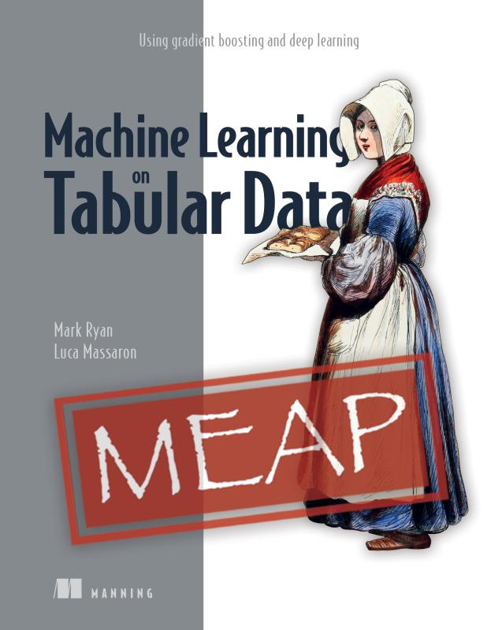

# Machine Learning on Tabular Data   Using gradient boosting and deep learning
 

Mark Ryan and Luca Massaron 
MEAP began August 2023  Publication in Spring 2024 (estimated) 
ISBN 9781633438545  375 pages (estimated)  printed in black & white  
<table>
  <tr>
    <td style="border: none; padding: 0; vertical-align: top;">
      

      <B>Running code directly on Google Colab:
      
 
      
        
      
        
      
        
      
        
      
        
      
    </td>
    <td style="border: none; padding: 0;">
      
    </td>
  </tr>
</table>
http://mng.bz/jPlP

Business runs on tabular data in databases, spreadsheets, and logs: crunch that data using deep learning, gradient boosting, and other machine learning techniques.

 

Every organization in the world stores data in tables. Machine Learning on Tabular Data reveals practical techniques for applying machine learning techniques like deep learning and gradient boosting to your company’s rows and columns.

Inside Machine Learning on Tabular Data you’ll learn how to:

* Pick the right machine learning approach for your data
* Apply deep learning to tabular data
* Deploy tabular machine learning locally and in the cloud
* Pipelines to automatically train and maintain a model

This book collects best practices, hard-won tips and tricks, and hands-on techniques for making sense of tabular data using advanced machine learning techniques. Inside, you’ll discover how to use XGBoost and LightGBM on tabular data, optimize deep learning libraries like TensorFlow and PyTorch for tabular data, and use cloud tools like Vertex AI to create an automated MLOps pipeline.
