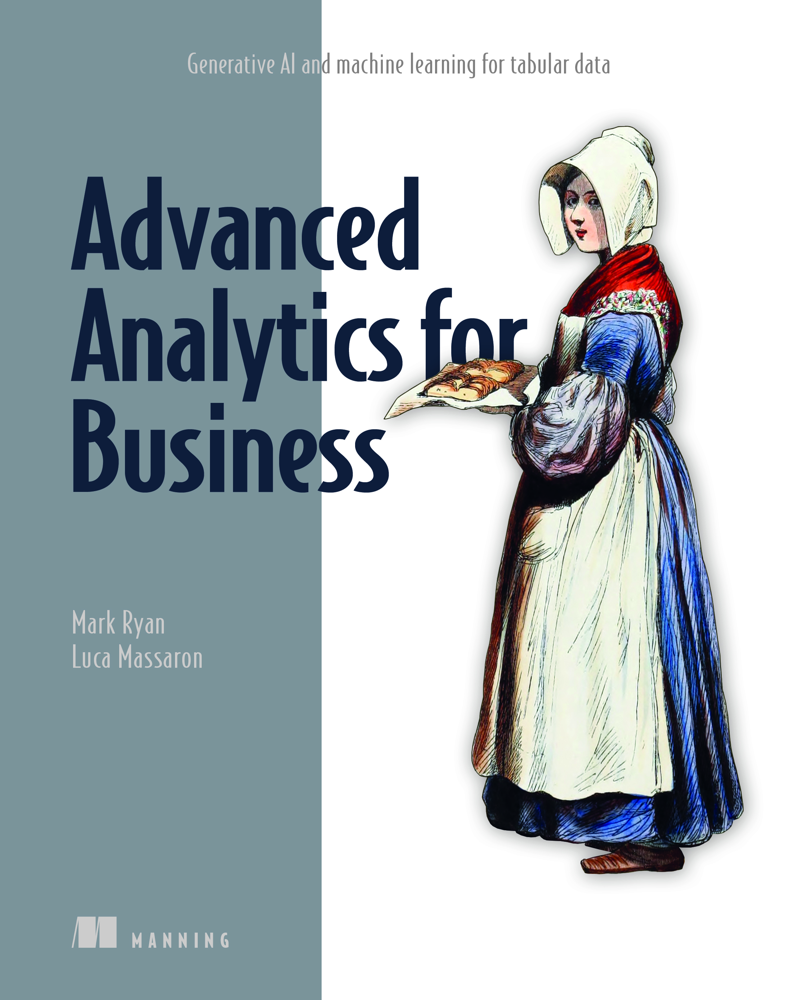

# Advanced Analytics for Business 
 <B>Generative AI and machine learning for tabular data</B>
 

[Mark Ryan](https://www.linkedin.com/in/mark-ryan-31826743/) and [Luca Massaron](https://www.linkedin.com/in/lmassaron/) 
MEAP began August 2023  Publication in Summer 2024 (estimated) 
ISBN 9781633438545  375 pages (estimated)  printed in black & white  
<table>
  <tr>
    <td style="border: none; padding: 0; vertical-align: top; width: 400px;">
      

      <B>Running code directly on Google Colab:
      
 
      
        
      
        
      
        
      
        
      
        
      
    </td>
    <td style="border: none; padding: 0; text-align: left;">
      
    </td>
  </tr>
</table>
http://mng.bz/jPlP

<B>Business runs on tabular data in databases, spreadsheets, and logs. Crunch that data using deep learning, gradient boosting, and other machine learning techniques.</B>

Every organization in the world stores data in tables. Machine Learning on Tabular Data reveals practical techniques for applying machine learning techniques like deep learning and gradient boosting to your company’s rows and columns.

Inside Machine Learning on Tabular Data you’ll learn how to:

* Pick the right machine learning approach for your data
* Apply deep learning to tabular data
* Deploy tabular machine learning locally and in the cloud
* Pipelines to automatically train and maintain a model

This book collects best practices, hard-won tips and tricks, and hands-on techniques for making sense of tabular data using advanced machine learning techniques. Inside, you’ll discover how to use XGBoost and LightGBM on tabular data, optimize deep learning libraries like TensorFlow and PyTorch for tabular data, and use cloud tools like Vertex AI to create an automated MLOps pipeline.

**about the book**

Advanced Analytics for Business teaches you to train insightful machine learning models on common tabular data such as spreadsheets, databases, and logs. It covers classic machine learning techniques like gradient boosting and more contemporary deep learning approaches. You’ll find practical examples for every stage of the machine learning pipeline, such as using XGBoost and Keras to predict the prices of Airbnb listings in New York City and deploying a machine learning model on your local system with Flask. By the time you’re finished, you’ll be equipped with the skills to apply machine learning to the kinds of data you work with every day.

**about the reader**

For readers experienced with Python and the basics of machine learning.

**about the authors**

Mark Ryan is a technical writing manager at Google. He studied computer science at the University of Waterloo and at the University of Toronto. In addition to a keen interest in deep learning with tabular data, Mark is interested in applications of large language models.

Luca Massaron is a data scientist with more than a decade of experience in transforming data into smarter artifacts, solving real-world problems, and generating value for businesses and stakeholders. He is the author of bestselling books on AI, machine learning, and algorithms.
